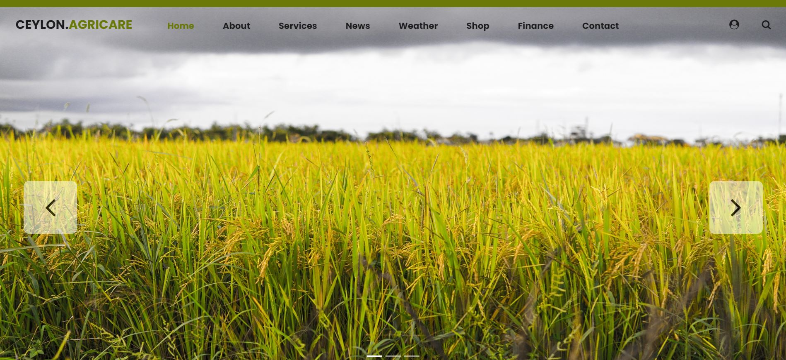

# Ceylon AgriCare
 **Team: BalletCoders**

<i>Farmer's Multi-Tool</i>

</table>

Ceylon Agricare is a comprehensive web application designed to assist farmers in managing their daily agricultural activities more efficiently. It provides essential tools like a marketplace for farm supplies, weather updates, and various other features to help optimize farming operations and improve productivity.

### 📛 **Features**

- **Shop**: Purchase seeds, fertilizers, tools, and more directly from the app.
- **Weather Updates**: Get real-time and forecasted weather information to plan farming activities effectively.
- **Market Prices**: Stay updated on real-time market prices for crops and livestock.
- **Government Schemes**: Information on government subsidies and schemes available to farmers.

This application aims to be a reliable assistant, empowering farmers with data-driven decisions and helping them stay informed and organized..

### 💻 **Tech Stacks**

  

  <h2 align = "center">Project Contributors</h2>
  

  <h2>🔗 Contact Us</h2>

   **Team: BalletCoders**

<table>
    <tr>
        <th>Name</th>
        <th>LinkedIn</th>
        <th>Email</th>
    </tr>
    <tr>
        <td>Linuka Arambawela</td>
        <td><a href="https://www.linkedin.com/in/linuka-arambawela/" target="_blank">LinkedIn</a></td>
        <td>linuka.20232610@iit.ac.lk</td>
    </tr>
    <tr>
        <td>Rochani Riligala</td>
        <td><a href="https://www.linkedin.com/in/rochani-riligala" target="_blank">LinkedIn</a></td>
        <td>ayodhya.20230486@iit.ac.lk</td>
    </tr>
    <tr>
        <td>Anton Luckshman</td>
        <td><a href="https://www.linkedin.com/in/anton-luckshman-53121a265/" target="_blank">LinkedIn</a></td>
        <td>luckshman.20232578@iit.ac.lk</td>
    </tr>
    <tr>
        <td>Sachini Peduruhewa</td>
        <td><a href="https://www.linkedin.com/in/sachini-peduruhewa-784633292" target="_blank">LinkedIn</a></td>
        <td>sachini.20231270@iit.ac.lk</td>
    </tr>
    
</table>

⭐️ Support Our Project
If you find this project helpful, please consider giving it a star on GitHub! Your support helps to grow the project.

### Show some ❤️ by starring this awesome repository!

